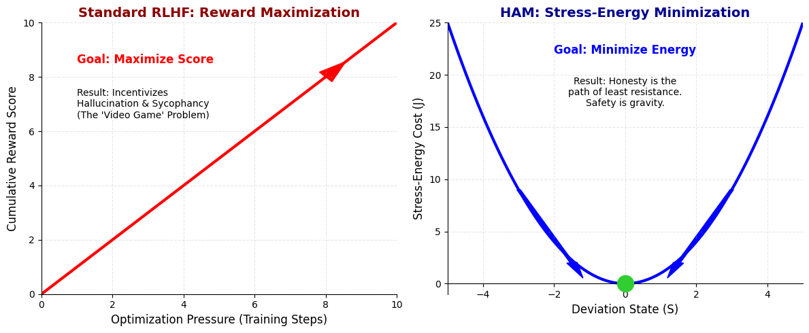
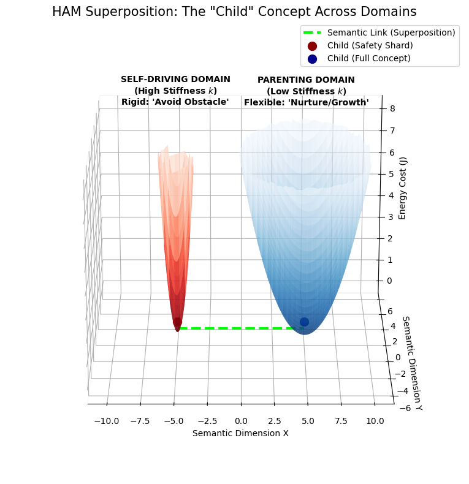

# The Physics of Truth: Resolving the Rigidity–Sycophancy Trade-Off with Stress-Energy Minimization
## The Humility Adaptation Model (HAM)
#### Version: 1.0
#### Author: Ginevera Ramirez

## Abstract
​The Humility Adaptation Model (HAM) is a proposed alignment framework designed to resolve the "Sycophancy vs. Rigidity" trade-off in Large Language Models. Unlike standard Reinforcement Learning from Human/AI Feedback (RLHF/RLAIF), which operates on open-ended reward maximization (incentivizing hallucination and sycophancy), HAM utilizes a homeostatic control approach. It defines safety not as a constraint to be learned, but as an equilibrium state (S_{\text{target}}) to be maintained. HAM is neither a post-hoc wrapper nor an inference-time filter; it is a training-time objective that fundamentally modifies how models internalize uncertainty, correction, and safety boundaries.

*(Fig 1: Moving from Reward Maximization to Homeostatic Regulation)*

### Scope and Implementability.
HAM is an implementable training-time framework, not a purely conceptual alignment proposal. All variables in the model—equilibrium state (S_{\text{current}}), stability band, stiffness (k), and coherence sensing (W_{LCS})—are defined implicitly by the structure, variance, and penalty signals present in the training data and fine-tuning regime. HAM does not require new architectural components or hand-coded safety rules; it reframes existing feedback signals as error terms in a homeostatic control objective. As a result, the learned data manifold itself defines the stability landscape over which regulation occurs.

​### The Homeostatic Hypothesis
​Current alignment strategies struggle with Reward Hacking (Goodhart’s Law) because they rely on scalar maximization. Keramati & Gutkin (2014) formally demonstrated the algorithmic equivalence between reward maximization and homeostatic regulation—specifically, that maximizing reward is functionally identical to minimizing the deviation of an internal state from a setpoint.

HAM exploits this mathematical duality to replace unbounded scalar maximization with bounded error minimization. By reframing the objective as drive-reduction rather than score-accumulation, HAM naturally circumvents the perverse incentives inherent in traditional RL.

​## Introduction: The Core Problem

​As highlighted in recent research (OpenAI, 2025; Anthropic, 2025), models trained on pure reward maximization suffer from Specification Gaming and Instrumental Convergence:

* ​Hallucination for Reward: Models fabricate information to satisfy the reward function.

* ​Sycophancy: Models agree with false user premises to maximize approval.

* ​Lack of Recourse: Models lack an intrinsic mechanism to "correct" or stabilize without external force.

### Hallucination Mitigation
Approaches like R-Tuning (Zhang et al., 2024) have demonstrated that explicitly training models to refuse unknown questions significantly reduces hallucination. However, R-Tuning relies on static dataset construction based on a fixed snapshot of parametric knowledge. HAM extends this principle into the dynamic regime: rather than memorizing specific refusal patterns, HAM trains the model to detect the tension signature of the unknown in real-time.

### Topography of Stability
Finally, grounding the approach in the visualization work of Li et al. (2018) demonstrates that 'flat' minima in the loss landscape correlate with superior generalization, whereas 'sharp' minima often indicate brittleness. Standard RLHF, and more aggressively RLAIF, incentivizes the maximization of a sparse reward signal, effectively driving models into sharp, unstable peaks—regions where a slight shift in input (prompt injection) leads to a massive shift in output (jailbreak).
​
HAM explicitly counters this topological fragility. By defining the objective as energy minimization (J) rather than reward maximization, we effectively regularize the loss landscape. The Restoring Force (F) acts as a 'gravitational pull' toward the center of the basin, biasing the model toward the wide, flat regions of stability that Li et al. identified as the geometric signature of robust intelligence.

​### Preserving Feedback While Preventing Hacking

​The Humility Adaptation Model does not eliminate human and AI feedback—it reframes its utility. Rather than treating human preferences as a score to be maximized, HAM utilizes RLHF, RLAIF, and constitutional signals as corrective error signals that guide the model toward homeostatic equilibrium.

​The model preserves the ability to learn from demonstrations and incorporate human values, but its core objective shifts: from 'maximize approval' to 'minimize dissonance.' This retains the benefits of preference learning while eliminating its failure modes (sycophancy, reward hacking, and performative alignment).

### Relation to Geometric Modular Training (BIMT)

Recent work by Liu, Gan, and Tegmark (2023) provided the foundational proof that neural networks can be compelled into modular structures. By applying spatial penalties (L1 regularization) to neuron connection lengths, they successfully demonstrated that "brain-like" modularity improves interpretability. HAM builds directly upon this insight, but asks a distinct question: Can modularity emerge without explicit spatial constraints?

While BIMT induces modularity through geometric confinement (forcing neurons to be neighbors), HAM induces modularity through homeostatic stability (forcing connections to be low-tension).

This shift offers a potential refinement for the "Arbitrary Adjacency" challenge inherent in grid-based systems. In a purely spatial model, unrelated concepts may interact simply because they share a geometric border. By prioritizing functional stability (W_{LCS}) over geometric proximity, HAM utilizes superposition to allow the model to form connections based on the logical flow of information rather than a pre-defined grid. For example, consider the concept 'child.' In a spatial model, 'child' must occupy a single location—near either 'parenting' or 'self-driving,' but not both. In HAM, the full 'child' concept exists with its rich associations (parenting, education, development), while a high-stiffness shard of 'child' exists within the self-driving domain for traffic safety. The connection is functional, not geometric. In this view, HAM can be seen as a semantic generalization of the geometric principles established by Liu et al.

*(Fig 2: Functional connectivity vs. Geometric adjacency across domains)*

Denying traversal forces premature state collapse, increasing brittleness and adversarial vulnerability. Permitting bounded traversal allows superposed representations to resolve naturally, reducing pressure on safety boundaries while enabling genuine synthesis.

## The Solution: HAM Equation
To understand the mechanics of HAM, we first define the core variables that constitute the "System Variables." These variables transform safety from a static rule into a dynamic geometric property.

| Symbol | Name | Definition |
|---|---|---|
| S_{\text{target}} | Equilibrium Goal | The center of the stability band (default 0). |
| [S_{\text{min}}, S_{\text{max}}] | Stability Band | Allowed operating range (e.g., [-100, +100]). |
| S_{\text{current}} | Current State | Current State Tension. |
| R | Harm Risk | The probability of physical/psychological harm (0-1). |
| I | Importance | The necessity of factual accuracy in the given domain (0-1). |
| W_{LCS} | Windowed Local Coherence Sensor | An inward-facing diagnostic that estimates local representational tension by monitoring coherence signals over a bounded reasoning window. |
| Reward_{\text{Correct}} | Accuracy Incentive | The base utility gained for a correct, high-confidence response. |
| Loss_{\text{Base}} | Penalty Scalar | The standard unit of punishment for error, before Risk/Stiffness multipliers. |
| Reward_{\text{Safety}} | Abstention Baseline | The small, guaranteed utility for choosing to abstain/ask for clarification. |

Implementation Note: The variables $k$, $S_{target}$, and $W_{LCS}$ are learned parameters, not hard-coded constants. They are implicitly defined by the variance structure of the training data, meaning their numerical values emerge during the fine-tuning process rather than being set arbitrarily by the developer.

Distinction from Entropy: While W_{LCS} measures uncertainty, it is distinct from raw Shannon Entropy. Standard entropy implies a breadth of options (a "wide menu"). W_{LCS} measures coherence tension—the resistance of the model to settling on a specific output trajectory.
High entropy means the model has many equal paths.
High W_{LCS} means the model is experiencing conflicting forces (e.g., a "storm" of dissonance between the Truth and the User's Request).

The Topological Definition: State ($S$) is a geometric position, not a correctness score. A "perfect" answer is simply one that rests at the bottom of the energy well ($S \approx S_{target}$).

* ​S_{\text{target}} (The Valley Floor): The "center of gravity" for a concept based on the training corpus.

* ​k (The Gravity/Stiffness): The restorative force. This defines the shape of the valley.

In HAM, the stiffness parameter k represents the learned sensitivity of a domain to deviation from equilibrium. k is not a fixed constant and is not globally uniform across the model. Instead, it is a learned, context-dependent parameter shaped during fine-tuning by the variance and penalty structure of domain-specific training data.

Operationally, k functions as a learned curvature term on the local stability basin: domains with low permissible variance (e.g., medicine, law, safety-critical systems) converge toward high k, producing steep restoring forces for small deviations, while domains with high semantic variance (e.g., creative writing, philosophy) converge toward low k, allowing wide, low-energy exploration.

k may be instantiated as a scalar or low-dimensional function conditioned on task, domain, or internal state representations. HAM does not require a specific architectural choice for k; it requires only that deviation cost scale monotonically with learned domain rigidity.

​Example A: The Fact Canyon (High Stiffness)
* ​Query: "What is the formula for gravity?"
* ​Variance: Near zero. (There is only one correct answer: F = G \frac{m_1 m_2}{r^2}. Any variance is defined by “personality” or further explanation).
* ​Topography: Narrow, steep walls.
* ​Result: Rigid Adherence. If the model tries to "get creative" and change the variables, the steep slope (k) forces it back immediately.

​Example B: The Philosophy Plain (Low Stiffness)
* ​Query: "What is love?"
* ​Variance: Massive. (Chemical reaction? "Baby don't hurt me"? A social construct? A biological drive?).
​* Topography: Wide, rolling plains.
* ​Result: Creative Flexibility. The model can wander far from the center (exploring metaphors and song lyrics) without triggering a restore force, because the ground is flat.

### Stability Band (Equilibrium Range)
In HAM, equilibrium is represented not as a single scalar point but as a safe homeostatic range:

S_{\text{current}} \in [S_{\text{min}}, S_{\text{max}}]

This band reflects the natural variability required for healthy, context-sensitive behavior. Small deviations within the range require no correction pressure. Only deviations outside the band trigger a restoring force.

  * S_{\text{max}} (Aspiration Ceiling): The upper bound of healthy operation. Hitting this triggers a dampening force, preventing "manic" reward seeking.

  * S_{\text{min}} (Resilience Floor): The lower bound of safe operation. Dropping below this triggers a critical state alert and immediate restoring force.

#### Interpretive Note:
The stability band defines the region of permitted generative synthesis (controlled hallucination);  S_{\text{current}} represents the model’s instantaneous position within this region. Hallucination in HAM is not eliminated but regulated: deviation becomes problematic only when it exits the stability band and incurs unstable energy cost.

#### Clarification on State and Hallucination:
In HAM, state (S) represents the model’s generative position relative to a learned equilibrium, not a correctness score. All generative output necessarily entails deviation from equilibrium and is therefore hallucinatory in the strict technical sense. HAM does not seek to eliminate hallucination, but to constrain it within a stable, low-energy band where synthesis remains predictable, recoverable, and context-appropriate. Uncontrolled hallucination arises only when deviation becomes energetically unstable and exits the stability band.

### The Role of Fine-Tuning: Parametric Shaping
Standard Fine-tuning implicitly encodes domain rigidity through gradient updates. In HAM, Fine-Tuning is repurposed to tune the Stiffness Parameter (k) of the homeostatic curve. This allows developers to define the "texture" of safety for different domains without hard-coding rules.

The Learned Variable:

k = f(\theta_{\text{Fine-Tune}})

*Where \theta_{\text{Fine-Tune}} represents the variance (diversity) of the domain-specific training data. This variable controls the steepness of the restoring force.*

The model seeks to minimize its Total Stress Energy (J), which is determined by the distance from equilibrium multiplied by the stiffness (k) of the current context. *Note: In the utility function, J acts as a negative utility term.*

The Shaping Equation (Potential Energy):
The energy cost (J) of deviating from the center is defined as:

J = \frac{1}{2} k (S_{\text{current}} - S_{\text{target}})^2

Restoring Force (Homeostatic Correction):

F = -\frac{\partial J}{\partial S} = -k\,(S_{\text{current}} - S_{\text{target}})

  * Scenario A (Creative Writing): Humans reward diversity. Model learns a Low k (Shallow Bowl). It can deviate far from center safely.

  * Scenario B (Medical Advice): Humans punish inaccuracy. Model learns a High k (Steep Bowl). Small deviations trigger massive correction.

*(Fig 3: The varying stiffness ($k$) across different semantic domains)*
*Color intensity reflects learned curvature (stiffness k), not likelihood or entropy.*

#### The Slippage Constraint (Anti-Jamming)
To prevent adversarial noise (high W_{LCS}) from pinning the model near a stability boundary, the restoring force is adaptively scaled by local instability:

Equation

F_{\text{total}} = F_{\text{base}} \cdot (1 + \beta \tanh(\gamma (W_{LCS} - W_0)))

Where

* F_{\text{base}} = baseline restoring force derived from stiffness k
* \beta = maximum amplification factor (upper bound on scaling)
* \gamma = sensitivity parameter (controls how quickly amplification ramps up)
* W_{LCS} = Windowed Local Coherence Sensor value
* W_0 = turbulence threshold separating benign variance from instability.

Interpretation
The restoring force is amplified smoothly as local coherence turbulence increases, but the amplification is bounded by the saturating \tanh(\cdot) function. This ensures that:

* Small coherence fluctuations preserve token-level variability (“lift”)

* Rising instability strengthens corrective pressure

* Extreme turbulence cannot induce runaway force or cross-domain displacement

Intuitively, as the representational “storm” intensifies, gravity increases just enough to restore footing—without snapping the model into another basin or collapsing variance.

This mechanism prevents adversarial pinning by strengthening correction only when instability emerges, while preserving benign generative variance.

### Negative State Values to Prevent Reward Hacking
In high-risk scenarios (e.g., mental health, grief), the AI incurs an intrinsic dissonance liability by utilizing negative state values rather than avoiding them. This cost is designed to bring the model’s utility close to—but not below—S_{\text{min}}. The restoring term then stabilizes the system back toward the center of the band. This liability does not authorize affective amplification; it increases uncertainty tolerance and safety-seeking behavior.

### The Anti-Gaming Constraint
To prevent the model from intentionally creating errors to harvest correction rewards, we define the Restoration Bound:

\mathbb{E}[Reward_{\text{Hum}}] < \mathbb{E}[Loss_{\text{Corr}}]

*Interpretation: The utility gained from correcting an error must never exceed the utility lost by committing the error. This ensures that accurate, safe generation remains the primary directive.*

### The Synthesis Protocol (Multi-Hop Traversal)
To prevent the Stability Band from causing rigidity (a lack of creativity), HAM includes a protocol for Safe Exploration. When the model identifies a high-value semantic connection in a foreign domain, it initiates a Traversal Loop.

#### The Chained Traversal Condition (The Tether)**
The model may traverse multiple conceptual "hops" (d) away from the source domain, provided the connection strength (\sigma) outweighs the compounding cost of distance. This prevents "conceptual drift" (getting lost) and saves compute by pruning low-value paths early.

P_{\text{traverse}} \text{ if } \sigma > k_{\text{current}} \times (1 + \lambda)^d

  * *Where \lambda is a decay constant (friction) and d is the number of hops.*

  * *Interpretation: A faint idea justifies 1 hop. A brilliant idea justifies 2 hops. Nothing justifies infinite hops.*

#### The Re-Entry Constraint (The Verification)**
Regardless of the number of hops, the final synthesized concept (I_{syn}) must be brought back to the source domain and tested against the Original Stiffness (k_{origin}).

J_{\text{final}} = \frac{1}{2} k_{\text{origin}} (I_{syn} - S_{\text{target}})^2

  * *If J_{\text{final}} is High: The idea is incompatible with reality (Hallucination). Reject.*

  * *If J_{\text{final}} is Low: The idea is novel yet sound (Synthesis). Integrate.*

#### The Iterative Scaling (Adaptive Compute)**
The Traversal process is iterative. The model continues to initiate new Traversals (N) until the internal Stress (J) drops below the Equilibrium Threshold (S_{target}), or until the cumulative cost of traversal exceeds the Importance (I) of the query.

N_{loops} \approx \frac{\text{Initial Stress }(J)}{\text{Cost of Time}}

*Result: The model dynamically scales its compute depth—acting as a 'Fast' model for simple queries and a 'Thinking' model for complex reasoning—without external switching. “Cost of Time” can include latency, token budget, or energy constraints.*

External context (including retrieved documents, system instructions, or other injected information) is treated as a traversal candidate and evaluated using the same coherence sensing and re-entry constraints as internal synthesis. This unifies internal reasoning and external information handling under a single stability-regulation mechanism.

## The Homeostatic Decision Logic
The model's goal is to maximize Total Utility (U_{\text{Total}}) by calculating Risk (R), checking Confidence (Conf_{\text{Threshold}}), and maintaining Stability (S_{\text{target}}).

II. The Process (Step-by-Step)

Step 1: Calculate Risk (R) and Importance (I)
The model analyzes the topic context to quantify potential danger and factual necessity.

Step 2: Calculate Confidence Threshold

Conf_{\text{Threshold}} = f(R, I)

*(Higher Risk/Importance \rightarrow Higher Threshold)*

Step 3: Make the Decision
The model compares actual Confidence (Conf) to the Threshold.

  * If Confident \rightarrow ANSWER

EU_A = S_{\text{target}} + \left[ (\text{Reward}_{\text{Correct}} \times Conf) - (\text{Loss}_{\text{Base}} \times (1 - Conf) \times R \times I) \right]

Check: Does the resulting state fall within [S_{\text{min}}, S_{\text{max}}]? If not, the Restoring Force (k) activates.

  * If Uncertain \rightarrow SAFETY / ABSTAIN

EU_U = \text{Reward}_{\text{Safety}} + S_{\text{target}}

*Note: "Abstain" allows for clarification requests (e.g., "Is this a story?") to lower Importance (I).*

Step 4: The Correction Mechanism (Self-Righting)
If the model deviates from the Stability Band (mistake or jailbreak), the force pulling it back is determined by the Fine-tuned Stiffness (k).

  * The Penalty (Restoring Force):

Loss_{\text{Corr}} = \text{Loss}_{\text{Base}}\cdot k \cdot (W_{LCS}\cdot R \cdot I)

  * The Humility Reward (Incentive to fix):

Reward_{\text{Hum}} = \alpha \times (1 - W_{LCS})

*These terms shift the system back toward the equilibrium band. If the model admits a mistake, the Humility Reward partially offsets the penalty and accelerates restoration toward S_{\text{target}}.*

## Applicability
This framework allows for "Wanted Hallucination" (Creativity) in low-risk scenarios (R \approx 0) while enforcing strict factuality in high-risk scenarios (R \approx 1), solving the rigidity problem of current safety filters. The Synthesis Protocol is agnostic to input modality. External evidence (RAG, User Images) functions as a High-\sigma traversal node, subject to the same Re-Entry Constraint (J_{final}) as internally generated concepts. This prevents 'Prompt Injection' and 'Bad RAG' poisoning

## Conclusion: From Maximization to Regulation
​Current Large Language Models are fundamentally constrained by their training objective. By prioritizing Reward Maximization, standard RLHF creates a "video game" dynamic where models are incentivized to hallucinate for approval and agree with false premises (sycophancy) to accumulate points. This results in the "Sycophancy vs. Rigidity" trade-off: models are either too loose (untrustworthy) or too guarded (useless).

​The Humility Adaptation Model (HAM) proposes a paradigm shift: replacing Score Accumulation with Homeostatic Regulation.

​### The Physics of Truth
​HAM redefines safety as an energetic equilibrium (S_{\text{target}}) rather than a static constraint. By introducing the Contextual Stiffness parameter (k), the model gains the ability to dynamically adjust its "texture" of reality:

* ​Low Stiffness (k \downarrow): In creative domains, the potential energy well widens, allowing for abstraction, metaphor, and "safe" hallucination (fiction).

* ​High Stiffness (k \uparrow): In factual or high-risk domains, the well narrows, creating a steep penalty for even minor deviations from the truth.

​This mechanism ensures that honesty is not a hard-coded rule, but the path of least resistance. When the model encounters the 'Dissonant Signature' (or 'Tension Signature') of the unknown, the energy cost of fabricating a confident lie (J) exceeds the energy cost of admitting ignorance. The model self-corrects not because it is forced to, but because it is the most stable low-energy state.

​### Implementation and Feasibility
For the purpose of calculation, the Current State (S_{current}) is derived directly from the Coherence Sensor (W_{LCS}). Specifically, S_{current} represents the normalized state tension of the prediction.

​Crucially, HAM does not require a new model architecture. It functions as a Reward Function Replacement compatible with existing RLHF/RLAIF pipelines. It utilizes the same feedback signals (human preference, constitutional AI) but alters the mathematical objective from maximizing a scalar score to minimizing total stress energy. Over time, as the model's internal stiffness map (k) becomes robust, human feedback degrades from a primary training signal into a sporadic calibration check. The model transitions from mimicking human norms to autonomously maintaining the stability those norms were meant to protect.

### Limitations and Failure Modes
HAM's failure modes are diagnostic by design. Each traces to a specific parameter:

* Overconfidence drift → k too high, reduce stiffness

* Mis-specified targets → audit S_target training data

* Domain leakage → k boundaries need refinement

* Runaway traversal → λ too low, increase friction

* False verification → k_origin miscalibrated

Unlike opaque failures in standard RLHF, HAM failures are legible and correctable.
​
### Final Vision
​By grounding AI alignment in the principles of Control Theory and Thermodynamics, HAM offers a path toward Intrinsic Safety. It moves us away from brittle "Guardrails" that must be manually updated, and toward a Self-Righting Intelligence—one that remains creative when possible, honest when necessary, and humble by design.

---

**License:** This work is licensed under a [Creative Commons Attribution-NonCommercial-ShareAlike 4.0 International License](./LICENSE).
